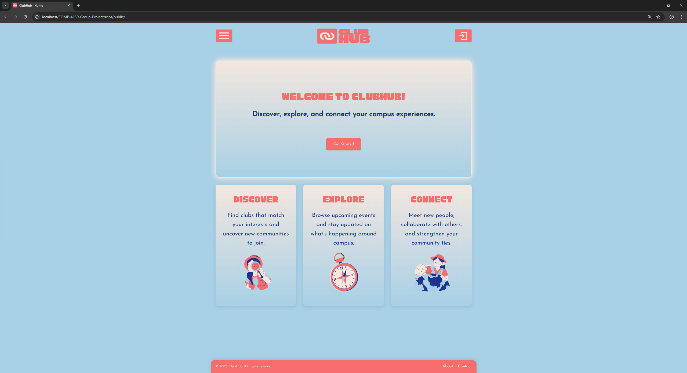
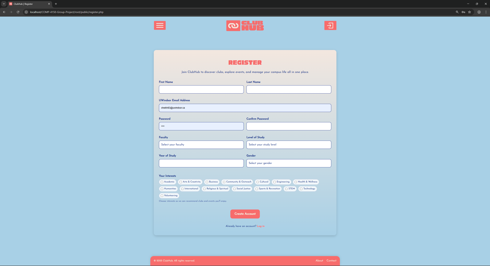
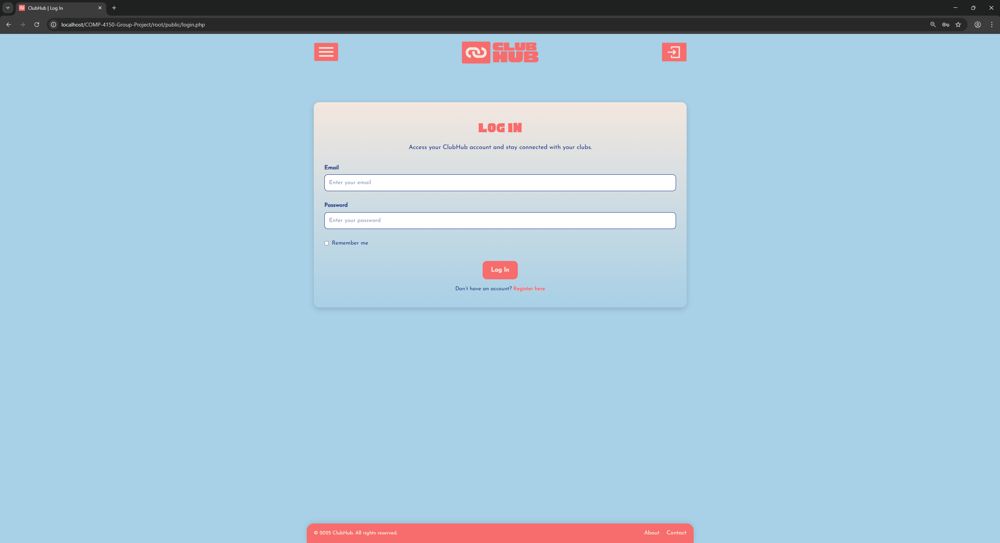
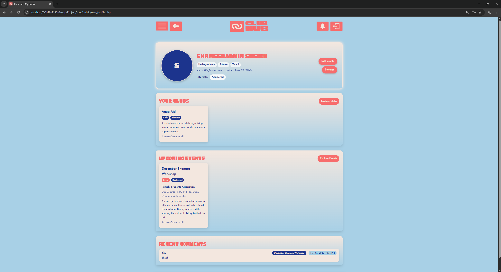
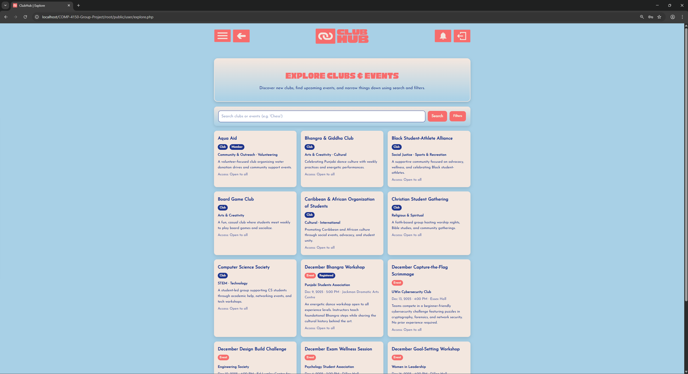
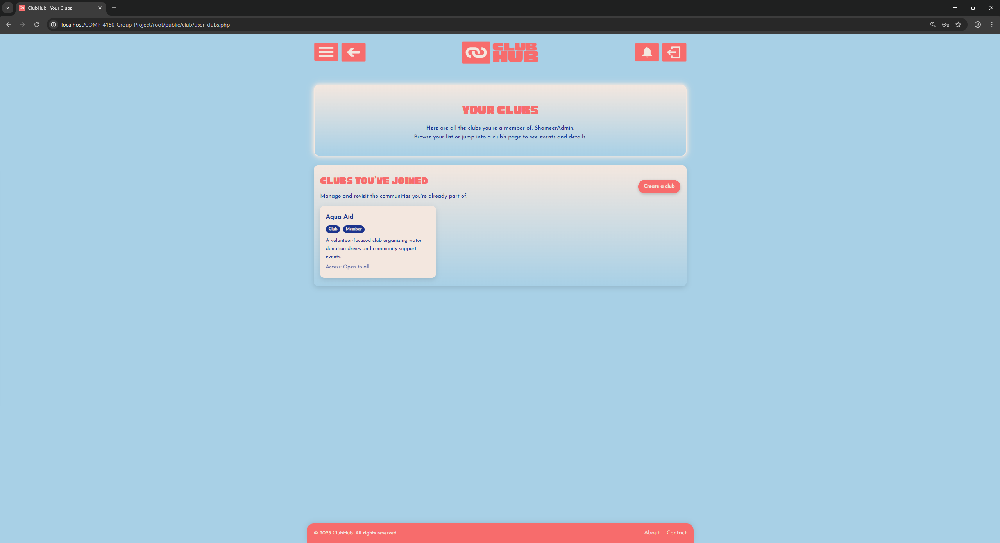
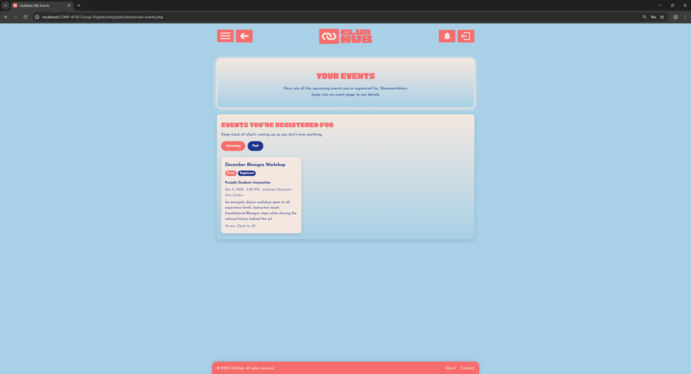
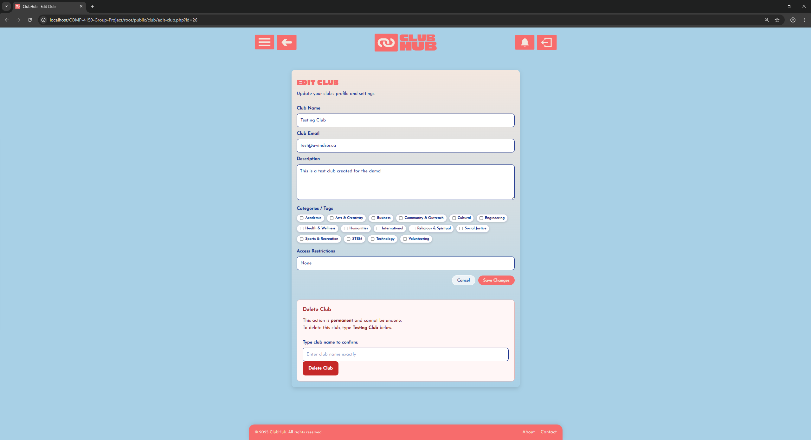
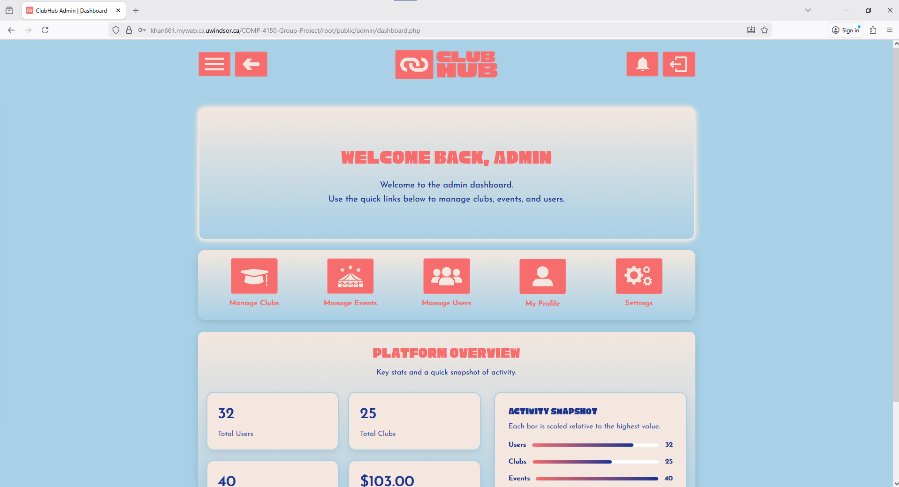
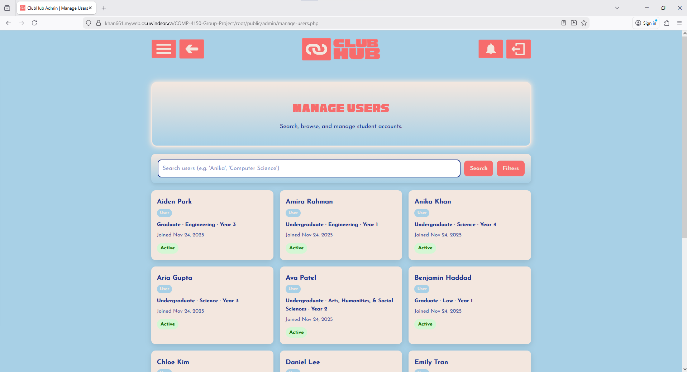

# ClubHub: Campus Events Platform

ClubHub is a web-based platform for discovering clubs and events at the University of Windsor. It connects students, club executives, and administrators in a single centralized system where users can explore clubs, register for events, and manage campus activities.

> **Live Demo**  
> 🌐 https://khan661.myweb.cs.uwindsor.ca/COMP-4150-Group-Project/root/public/  

> **Repository**  
> 💻 https://github.com/nikerdz/COMP-4150-Group-Project

---

## Features

### 👩‍🎓 Student Features

- Create an account using a valid `@uwindsor.ca` email.
- Edit profile details (name, faculty, level of study, year).
- Select interests to receive more relevant club and event recommendations.
- Browse active clubs with search and filters by:
  - Category (e.g., academic, cultural, special interest)
  - Eligibility conditions (e.g., women-only, undergrad-only, first-year-only)
- Join, leave, and create clubs.
- Browse upcoming approved events and:
  - Register / unregister for free events.
  - Register and pay for paid events via a simulated payment flow.
- Comment on event pages and manage (delete) their own comments.
- View:
  - Joined clubs
  - Registered events (upcoming and past)
  - Payment history
  - Notifications (event updates, approvals, comments, payments, etc.)

### 🧑‍💼 Club Executive Features

After creating a club, the student will be marked as an executive for that club and gets extra options:

- Manage club profile:
  - Update club name, description, contact email, and eligibility conditions.
  - Edit associated categories and tags.
- Create new events for their club:
  - Set title, description, capacity, location, date/time, and fees.
- Edit existing events (details, capacity, timing, etc.).
- Cancel or delete events (cleaning up related registrations, comments, and payments).
- View membership and registration lists to monitor engagement.

Executive-only controls (e.g., “Manage Club”, “Create Event”) only appear when the logged-in user is an executive for that specific club.

### 🛠️ Administrator Features

Users with `user_type = 'admin'` get a dedicated admin dashboard and tools to:

- **Manage users**
  - Search and filter all users.
  - Suspend or reactivate accounts.
- **Manage clubs**
  - View clubs and deactivate or remove problematic ones.
- **Review and approve events**
  - See pending events.
  - Approve or unapprove events (approval triggers notifications to affected users).
- **Audit activity**
  - Inspect registrations, payments, and notifications for debugging and policy enforcement.

Admin-only pages are protected by strict role checks on every request.

---

## Architecture & Stack

### 🧩 Overall Architecture

- **Pattern:** Lightweight MVC-inspired structure
- **Backend:** PHP with models for each main entity (User, Club, Event, Membership, Registration, Payment, Comment, Notification)
- **Database:** MySQL with:
  - Tables for all entities
  - Stored procedures for all write operations (CRUD)
  - Key queries for read operations
  - Triggers for automated notification generation
- **Frontend:** HTML5, CSS3, and vanilla JavaScript
- **Local Dev Environment:** XAMPP (Apache + PHP + MySQL)
- **Deployment:** myWeb Apache server provided by the University of Windsor

### 🧱 Technologies Used

- **Front-End**
  - HTML5
  - CSS3 (modular templates + global theme)
  - JavaScript (no frameworks; DOM-based enhancements)
- **Back-End**
  - PHP (server-side logic, routing, handlers, sessions)
  - PDO for database access and prepared statements
- **Database**
  - MySQL
  - Stored procedures (e.g., `sp_user_register`, `sp_club_create`, `sp_event_create`)
  - Key query SQL files grouped by entity (e.g., `kq_user_find_by_email.sql`)
  - Triggers for:
    - Event lifecycle notifications (creation, approval, updates)
    - Payment confirmations
    - Comment-based notifications to executives

---

## Key Concepts

### 🔐 Roles & Permissions

- **Student**
  - Default role for all users.
  - Can manage their own profile, memberships, registrations, payments, and comments.
- **Club Executive**
  - A student linked to a club via the `Executive` table.
  - Gets additional management tools for that club only.
- **Administrator**
  - `user_type = 'admin'` in the `User` table.
  - Full system management: users, clubs, events, and audits.

Role information is stored in the database and enforced via server-side session checks on every protected page. The GUI dynamically adapts based on the current role.

### 🧮 CRUD & Data Access

- **Write operations (Create/Update/Delete)**
  - Implemented as MySQL stored procedures.
  - Called only through the PHP model layer.
- **Read operations**
  - Implemented as reusable SELECT queries in separate `.sql` files (“key queries”).
  - Executed via PDO prepared statements in the models.
- **Automation via triggers**
  - Notifications are generated inside the database when:
    - Events are created, approved, or updated.
    - Payments are created or refunded.
    - Comments are added to event pages.

This setup keeps PHP pages thin and pushes business rules into the database layer.

---

## User Interface & UX

### 🧭 Navigation & Layout

- **Landing page**
  - Hero banner with tagline and “Get Started” / “Dashboard” / “Admin Dashboard” button depending on login state.
- **Global header**
  - Sidebar (hamburger) button
  - Optional Back button for logged-in users
  - Centered ClubHub logo (home link)
  - Right-side icons for:
    - Notifications
    - Login/Logout
- **Role-aware sidebar**
  - **Guest:** Home, Login, Register  
  - **Student:** Dashboard, Explore, My Clubs, My Events, Profile, Settings  
  - **Admin:** Dashboard, Manage Events, Manage Clubs, Manage Users, Profile, Settings  

### 🧾 Notification Center

- Notification icon switches between static and animated states depending on unread notifications.
- Slide-down notification center shows recent notifications with read/unread styling.
- Users can toggle individual notifications between read and unread; the icon updates via AJAX calls to PHP handlers.

### 📱 Styling & Responsiveness

- Central stylesheet: `assets/styles/style.css`
  - Global theme colours (soft blues, cream, red accent)
  - Typography: custom fonts (`JosefinSans`, `Cubao`)
  - Layout utilities and reset
  - Scroll-to-top button styling
- Template-specific styles under `assets/styles/templates/` (e.g., landing, header, sidebar, dashboards, clubs, events, admin, notifications).
- Responsive breakpoints at approximately `1100px` and `768px` so the interface works well on laptops, tablets, and mobile devices.

### 🧩 JavaScript Behaviour

Main client-side logic lives in `src/scripts/js/script.js`:

- Sidebar open/close and overlay behaviour.
- Notification popup, unread-checking, and status toggling via fetch-based calls.
- Scroll-to-top button show/hide and smooth scrolling.
- Dashboard carousels (horizontal scroll sections for clubs/events).
- Tabbed views for clubs/events (pending/upcoming/past).
- “Load more” patterns on lists for clubs, events, comments, and admin tables.
- Quality-of-life features:
  - “Hold to view” password visibility behaviour.
  - Confirmation modals for destructive actions like account deletion.

Core interactions still degrade gracefully if JavaScript is disabled; forms submit directly to PHP handlers.

---

## Screenshots

- Landing page  
  

- Registration page  
  

- Login page  
  

- Profile page  
  

- Explore page (clubs & events)  
  

- Your Clubs page  
  

- Your Events page  
  

- Edit Club (executive view)  
  

- Admin dashboard  
  

- Manage Users (admin)  
  

---

## Running the Project Locally

1. **Clone the repository**

   ```bash
   git clone https://github.com/nikerdz/COMP-4150-Group-Project.git
   cd COMP-4150-Group-Project
   ```
2. Set up XAMPP
    - Install XAMPP.
    - Place the project inside your htdocs directory, e.g.: C:\xampp\htdocs\COMP-4150-Group-Project

3. Create the database
    - Start Apache and MySQL from the XAMPP control panel.
    - Open phpMyAdmin and create a new database (e.g. clubhub).
    - Run the provided SQL scripts (schema, stored procedures, triggers, and sample data).

4. Configure database connection
    - Update src/config/db_config.php with your local MySQL credentials and database name.

5. Access the site
    - Go to: http://localhost/COMP-4150-Group-Project/root/public/

## Credits

ClubHub was developed as a course project for COMP-4150 at the University of Windsor.

### Authors
- Anika Khan
- Shameer Sheikh